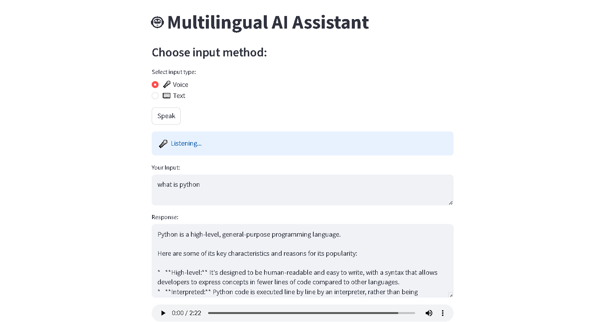

# 🤖 Multilingual AI Assistant

An intelligent **AI-powered assistant** that supports both **voice and text input**, detects the user's language, and responds in the same language with **speech output**.

---

## 🚀 Features

* 🎤 Voice input using Speech Recognition
* ⌨️ Text-based query input
* 🌍 Automatic language detection & multilingual response
* 🧠 AI responses powered by Google Gemini
* 🔊 Text-to-Speech output (audio playback + download)
* 🖥️ Interactive UI using Streamlit

---

## 🛠️ Tech Stack

* Python
* Streamlit
* Google Generative AI (Gemini API)
* SpeechRecognition
* gTTS (Google Text-to-Speech)
* python-dotenv

---

## 📸 Demo

 

---

## ⚙️ Setup Instructions

### 1️⃣ Clone the repository

```bash
git clone https://github.com/arjun250/Multilingual-AI-Assistant-.git
cd Multilingual-AI-Assistant-
```

---

### 2️⃣ Create virtual environment (recommended)

```bash
conda create -n assistant python=3.10
conda activate assistant
```

---

### 3️⃣ Install dependencies

```bash
pip install -r requirements.txt
```

---

### ⚠️ Additional Step (Windows Only – PyAudio Fix)

If you face issues installing `pyaudio`, run:

```bash
pip install pipwin
pipwin install pyaudio
```

---

### 4️⃣ Add API Key

Create a `.env` file in the root folder:

```env
GOOGLE_API_KEY=your_api_key_here
```

---

### 5️⃣ Run the application

```bash
streamlit run main.py
```

---

## 🧪 Usage

* Select input type (**Voice / Text**)
* Speak or type your query
* Get AI-generated response
* Listen to audio output or download it

---

## 📂 Project Structure

```
Multilingual-AI-Assistant/
│── main.py
│── requirements.txt
│── .env (not pushed)
│── logs/
│── speech.mp3
```

---

## ⚠️ Notes

* 🎤 Voice input works only on local machine (microphone required)
* 🔐 Do NOT share your `.env` file or API key
* ⚙️ Model availability may change based on API updates

---

## 🔮 Future Improvements

* 💬 Chat-style UI (like ChatGPT)
* 🌐 Language selection dropdown
* ☁️ Deployment (Streamlit Cloud / AWS)
* 🧠 Conversation memory

---

## 👨‍💻 Author

**Arjun Chaurasiya**

---

## ⭐ If you like this project

Give it a ⭐ on GitHub!
